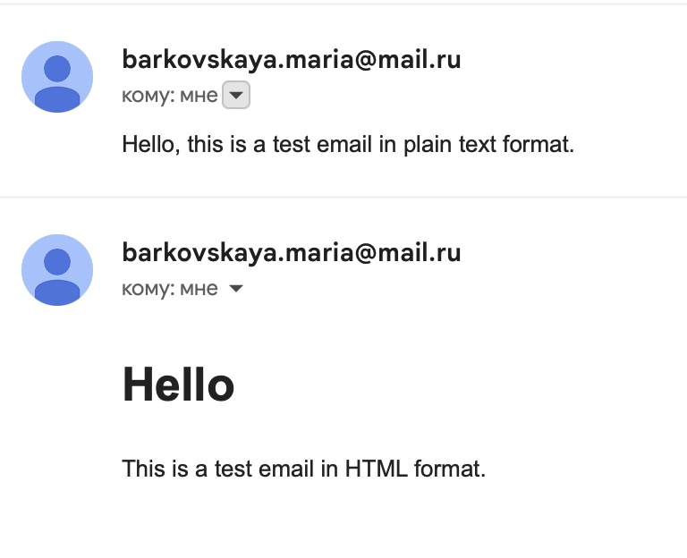
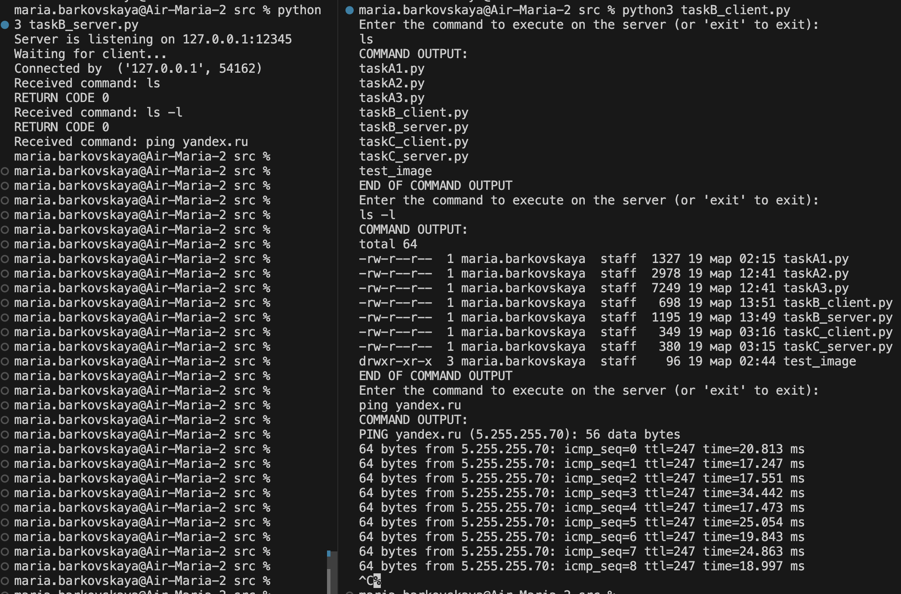
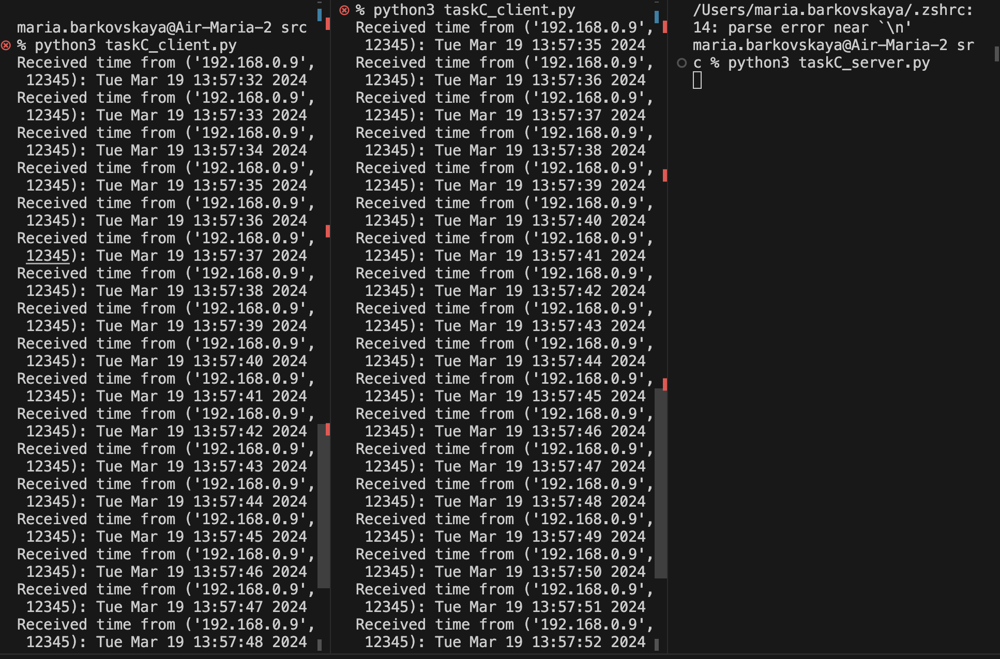
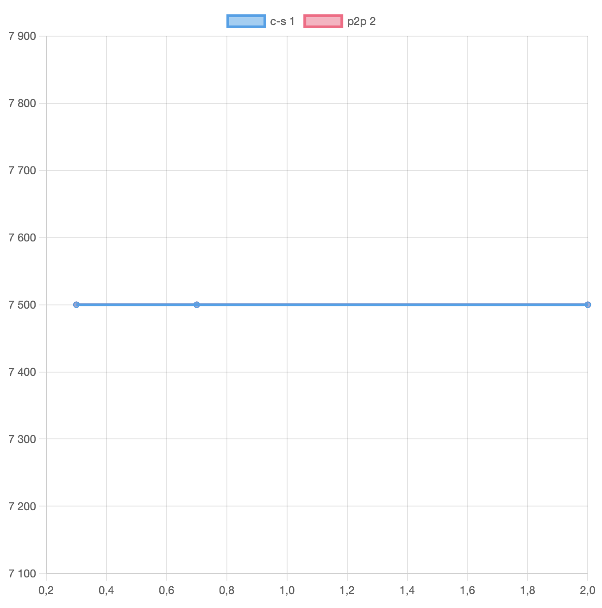
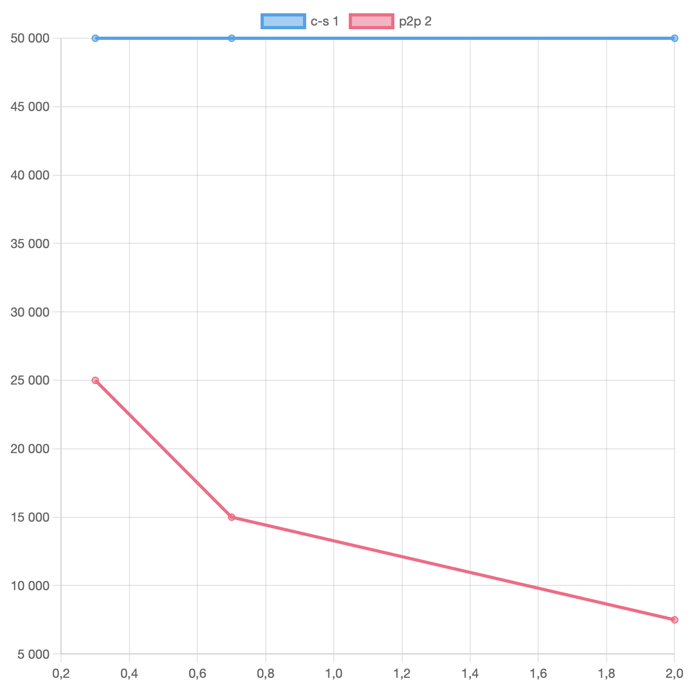
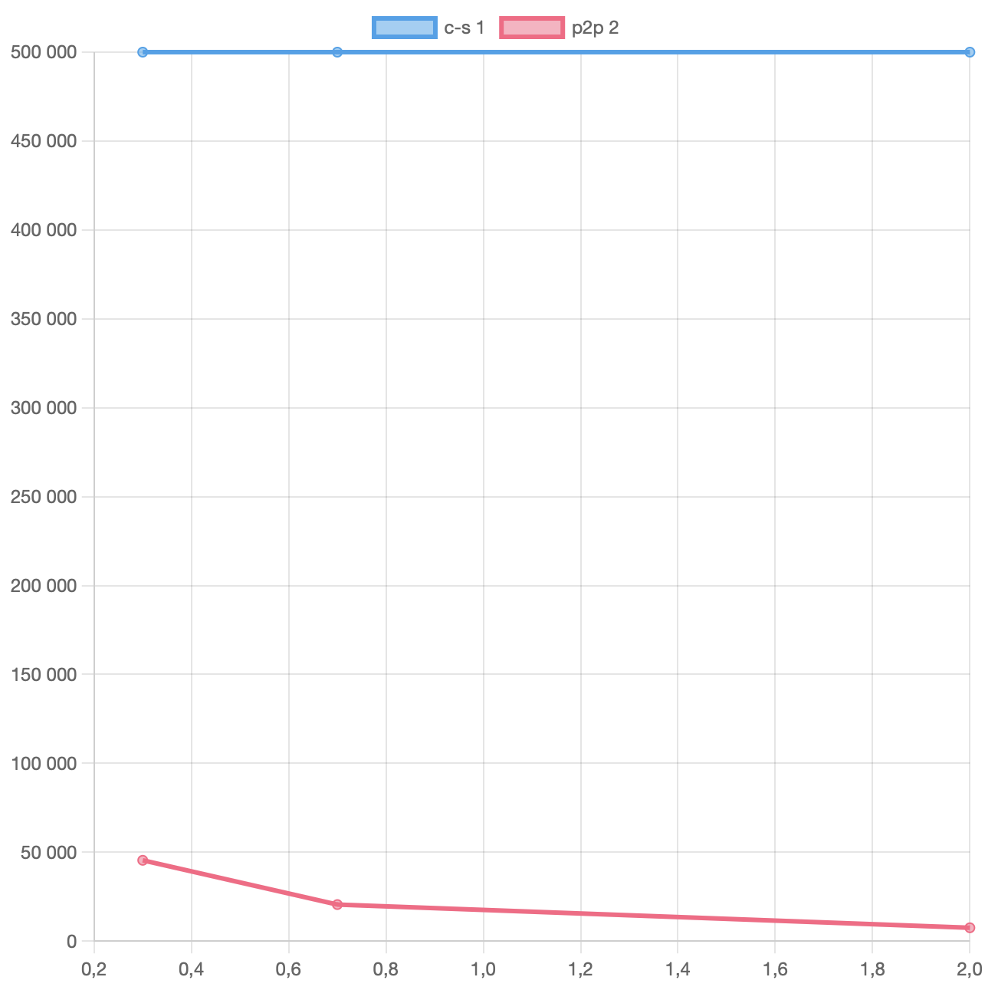

# Практика 5. Прикладной уровень

## Программирование сокетов.

### A. Почта и SMTP (7 баллов) - done

### 1. Почтовый клиент (2 балла) - done
Напишите программу для отправки электронной почты получателю, адрес
которого задается параметром. Адрес отправителя может быть постоянным. Программа
должна поддерживать два формата сообщений: **txt** и **html**. Используйте готовые
библиотеки для работы с почтой, т.е. в этом задании **не** предполагается общение с smtp
сервером через сокеты напрямую.

Приложите скриншоты полученных сообщений (для обоих форматов).

#### Демонстрация работы

### 2. SMTP-клиент (3 балла) - done
Разработайте простой почтовый клиент, который отправляет текстовые сообщения
электронной почты произвольному получателю. Программа должна соединиться с
почтовым сервером, используя протокол SMTP, и передать ему сообщение.
Не используйте встроенные методы для отправки почты, которые есть в большинстве
современных платформ. Вместо этого реализуйте свое решение на сокетах с передачей
сообщений почтовому серверу.

Сделайте скриншоты полученных сообщений.

#### Демонстрация работы

### 3. SMTP-клиент: бинарные данные (2 балла) - done
Модифицируйте ваш SMTP-клиент из предыдущего задания так, чтобы теперь он мог
отправлять письма с изображениями (бинарными данными).

Сделайте скриншот, подтверждающий получение почтового сообщения с картинкой.

#### Демонстрация работы

---

_Многие почтовые серверы используют ssl, что может вызвать трудности при работе с ними из
ваших приложений. Можете использовать для тестов smtp сервер СПбГУ: mail.spbu.ru, 25_

### Б. Удаленный запуск команд (3 балла) - done
Напишите программу для запуска команд (или приложений) на удаленном хосте с помощью TCP сокетов.

Например, вы можете с клиента дать команду серверу запустить приложение Калькулятор или
Paint (на стороне сервера). Или запустить консольное приложение/утилиту с указанными
параметрами. Однако запущенное приложение **должно** выводить какую-либо информацию на
консоль или передавать свой статус после запуска, который должен быть отправлен обратно
клиенту. Продемонстрируйте работу вашей программы, приложив скриншот.

Например, удаленно запускается команда `ping yandex.ru`. Результат этой команды (запущенной на
сервере) отправляется обратно клиенту.

#### Демонстрация работы

### В. Широковещательная рассылка через UDP (2 балла) - done
Реализуйте сервер (веб-службу) и клиента с использованием интерфейса Socket API, которая:
- работает по протоколу UDP
- каждую секунду рассылает широковещательно всем клиентам свое текущее время
- клиент службы выводит на консоль сообщаемое ему время

#### Демонстрация работы

## Задачи

### Задача 1 (2 балла) - done
Рассмотрим короткую, $10$-метровую линию связи, по которой отправитель может передавать
данные со скоростью $150$ бит/с в обоих направлениях. Предположим, что пакеты, содержащие
данные, имеют размер $100000$ бит, а пакеты, содержащие только управляющую информацию
(например, флаг подтверждения или информацию рукопожатия) – $200$ бит. Предположим, что у
нас $10$ параллельных соединений, и каждому предоставлено $1/10$ полосы пропускания канала
связи. Также допустим, что используется протокол HTTP, и предположим, что каждый
загруженный объект имеет размер $100$ Кбит, и что исходный объект содержит $10$ ссылок на другие
объекты того же отправителя. Будем считать, что скорость распространения сигнала равна
скорости света ($300 \cdot 10^6$ м/с).
1. Вычислите общее время, необходимое для получения всех объектов при параллельных
непостоянных HTTP-соединениях
2. Вычислите общее время для постоянных HTTP-соединений. Ожидается ли существенное
преимущество по сравнению со случаем непостоянного соединения?

#### Решение
Посчитаем некоторые задержки: 

$d_{\text{передачи}} = \dfrac{L}{R} = \dfrac{100000 \text{ бит}}{150 \text{ бит/с}} = 666.667$ c, а 

$d_{\text{распространения}} = \dfrac{d}{s} = \dfrac{10 \text{ м}}{300 \cdot 10^6 \text{ м/с}}$. 

Также назовем $t_{\text{control}} = \dfrac{200}{150} = 1.33$ c - время передачи управляющего пакета. Тогда:

1. Сначала мы запросим первый объект, потратив на это $3 \cdot (t_{\text{control}} + d_{\text{распространения}}) + (d_{\text{передачи}} + d_{\text{распространения}}) = 3 \cdot (1.33 + d_{\text{распространения}}) + (666.667 + d_{\text{распространения}}) = 4 + 3 \cdot d_{\text{распространения}} + 666.667 + d_{\text{распространения}} = 670.667 + 4 \cdot d_{\text{распространения}}$. Затем мы параллельно запросим оставшиеся объекты по 10 ссылкам (при этом скорость передачи уменьшится в 10 раз), потратив $3 \cdot (\dfrac{200}{15} + d_{\text{распространения}}) + (\dfrac{100000}{15} + d_{\text{распространения}}) = 3 \cdot (13.333 + d_{\text{распространения}}) + (6666.667 + d_{\text{распространения}}) = 40 + 3 \cdot d_{\text{распространения}} + 6666.667 + d_{\text{распространения}} = 6706.667 + 4 \cdot d_{\text{распространения}}$. Получаем, что суммарное время $= 670.667 + 4 \cdot d_{\text{распространения}} + 6706.667 + 4 \cdot d_{\text{распространения}} = 7377.334 + 8 \cdot d_{\text{распространения}} \approx 7377.335$
2. Для постоянного HTTP-соединения это время немного изменится. На запрос первого объекта мы все еще потратим $3 \cdot (t_{\text{control}} + d_{\text{распространения}}) + (d_{\text{передачи}} + d_{\text{распространения}}) = 670.667 + 4 \cdot d_{\text{распространения}}$, как мы посчитали в первом пункте, а вот на  объекты по ссылкам (за счет уже уcтановленного соединения) мы потратим $10 \cdot (\dfrac{200}{150} + d_{\text{распространения}} + \dfrac{100000}{150} + d_{\text{распространения}}) = 10 \cdot (1.33 + d_{\text{распространения}} + 666.667 + d_{\text{распространения}}) = 10 \cdot (668 + 2 \cdot d_{\text{распространения}}) = 6680 + 20  \cdot d_{\text{распространения}}$. Получаем, что суммарное время $= 670.667 + 4 \cdot d_{\text{распространения}} + 6680 + 20  \cdot d_{\text{распространения}} = 7350.667 + 24 \cdot d_{\text{распространения}} \approx 7350.7$. Выигрыш по времени со случаем непостоянного соединения незначителен.

### Задача 2 (3 балла) - done
Рассмотрим раздачу файла размером $F = 15$ Гбит $N$ пирам. Сервер имеет скорость отдачи $u_s = 30$
Мбит/с, а каждый узел имеет скорость загрузки $d_i = 2$ Мбит/с и скорость отдачи $u$. Для $N = 10$, $100$
и $1000$ и для $u = 300$ Кбит/с, $700$ Кбит/с и $2$ Мбит/с подготовьте график минимального времени
раздачи для всех сочетаний $N$ и $u$ для вариантов клиент-серверной и одноранговой раздачи.

#### Решение
Из лекции знаем, что для клиент-серверного подхода верно $D_{c-s} \geq \max\{NF/u_s, F/d_{min}\}$, а для одноранговой раздачи верно $D_{P2P} \geq \max\{F/u_s, F/d_{min}, NF/(u_s + \sum u_i)\}$. Из условия: $F = 15$ Гбит, $u_s = 30$ Мбит/с, $d_i = 2$ Мбит/с.

для $N = 10$ график: (линии слились)

для $N = 100$ график:

для $N = 1000$ график:

### Задача 3 (3 балла) - done
Рассмотрим клиент-серверную раздачу файла размером $F$ бит $N$ пирам, при которой сервер
способен отдавать одновременно данные множеству пиров – каждому с различной скоростью,
но общая скорость отдачи при этом не превышает значения $u_s$. Схема раздачи непрерывная.
1. Предположим, что $\dfrac{u_s}{N} \le d_{min}$.
   При какой схеме общее время раздачи будет составлять $\dfrac{N F}{u_s}$?
2. Предположим, что $\dfrac{u_s}{N} \ge d_{min}$. 
   При какой схеме общее время раздачи будет составлять  $\dfrac{F}{d_{min}}$?
3. Докажите, что минимальное время раздачи описывается формулой $\max\left(\dfrac{N F}{u_s}, \dfrac{F}{d_{min}}\right)$?

#### Решение

1. Пусть каждому пиру данные непрерывно отдаются со скоростью $\dfrac{u_s}{N}$. Так как по условию $\dfrac{u_s}{N} \le d_{min}$, то все пиры будут успевать принимать все передаваемые данные, а значит, каждый пир получит все данные за $F/v = \dfrac{NF}{u_s}$.
2. Теперь пусть каждому пиру данные непрерывно отдаются со скоростью $d_{min}$. Так как по условию $\dfrac{u_s}{N} \ge d_{min}$, то сервер сможет отдавать данные со скоростью $Nd_{min}$. Так как мы выбрали минимальную скорость загрузки среди всех пиров, то все клиенты будут успевать принимать эти данные, а значит, каждый пир получит все данные за $F/v = \dfrac{F}{d_{min}}$
3. Знаем, что сервер отправит все данные не раньше чем через $\dfrac{NF}{u_s}$, а все клиенты получат не раньше чем через $\dfrac{F}{d_{min}}$, то есть, действительно $D_{c-s} \geq \max\{NF/u_s, F/d_{min}\}$. Рассмотрим 2 случая и покажем, что умеем передавать ровно за $\max\{NF/u_s, F/d_{min}\}$:
   - пусть $\dfrac{u_s}{N} \le d_{min}$, тогда по пункту (1) можем передать данные за $\dfrac{NF}{u_s}$, при этом $\max\{NF/u_s, F/d_{min}\} = \dfrac{NF}{u_s}$
   - наоборот, пусть $\dfrac{u_s}{N} \ge d_{min}$, тогда по пункту (2) можем передать данные за $\dfrac{F}{d_{min}}$, при этом $\max\{NF/u_s, F/d_{min}\} = \dfrac{F}{d_{min}}$

