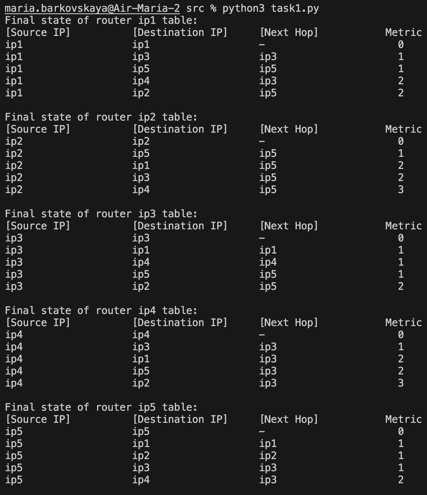
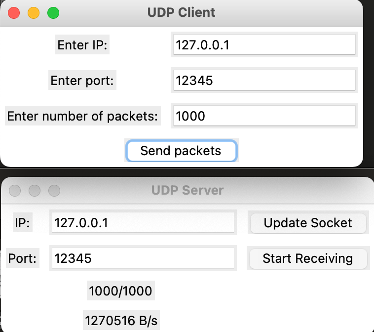

# Практика 12. Сетевой уровень

## 1. RIP (9 баллов) - done

### Задание А (6 баллов) - done
Реализуйте эмулятор работы протокола RIP в виде консольного приложения.
Ваша автономная сеть (АС) из маршрутизаторов может быть сконфигурирована на основе файла
(например, `.json`) либо генерироваться случайным образом каждый раз при запуске.

Каждый маршрутизатор должен иметь свой уникальный IP адрес. Это приложение не
предполагает передачу данных по сети, поэтому IP адреса, как и связи между маршрутизаторами,
могут быть произвольными.

Программа должна корректно работать с произвольной АС.

В конце работы программы для каждого маршрутизатора должна быть выведена таблица
маршрутизации. Пример таблицы:
```
Final state of router 198.71.243.61 table:
[Source IP]      [Destination IP]    [Next Hop]       [Metric]  
198.71.243.61    122.136.243.149     42.162.54.248           4  
198.71.243.61    157.105.66.180      42.162.54.248           2  
198.71.243.61    229.28.61.15        42.162.54.248           3  
198.71.243.61    42.162.54.248       42.162.54.248           1  
```

Приведите скрин или лог работы программы.

#### Демонстрация работы


### Задание Б (1 балл) - done
Выведите на консоль промежуточные этапы работы протокола: по каждому маршрутизатору
должна быть выведена его текущая таблица маршрутизации.

```
Simulation step 3 of router 42.162.54.248
[Source IP]      [Destination IP]    [Next Hop]       [Metric]  
42.162.54.248    122.136.243.149     157.105.66.180          3  
42.162.54.248    157.105.66.180      157.105.66.180          1  
42.162.54.248    229.28.61.15        157.105.66.180          2  
42.162.54.248    198.71.243.61       198.71.243.61           1  
```

#### Демонстрация работы
```
maria.barkovskaya@Air-Maria-2 src % python3 task1.py
Simulation step: 1

Simulation step of router ip1:
[Source IP]          [Destination IP]     [Next Hop]           Metric              
ip1                  ip1                  -                      0
ip1                  ip3                  ip3                    1
ip1                  ip5                  ip5                    1
ip1                  ip4                  ip3                    2
ip1                  ip2                  ip5                    2

Simulation step of router ip2:
[Source IP]          [Destination IP]     [Next Hop]           Metric              
ip2                  ip2                  -                      0
ip2                  ip5                  ip5                    1
ip2                  ip1                  ip5                    2
ip2                  ip3                  ip5                    2

Simulation step of router ip3:
[Source IP]          [Destination IP]     [Next Hop]           Metric              
ip3                  ip3                  -                      0
ip3                  ip1                  ip1                    1
ip3                  ip4                  ip4                    1
ip3                  ip5                  ip5                    1
ip3                  ip2                  ip5                    2

Simulation step of router ip4:
[Source IP]          [Destination IP]     [Next Hop]           Metric              
ip4                  ip4                  -                      0
ip4                  ip3                  ip3                    1
ip4                  ip1                  ip3                    2
ip4                  ip5                  ip3                    2
ip4                  ip2                  ip3                    3

Simulation step of router ip5:
[Source IP]          [Destination IP]     [Next Hop]           Metric              
ip5                  ip5                  -                      0
ip5                  ip1                  ip1                    1
ip5                  ip2                  ip2                    1
ip5                  ip3                  ip3                    1
ip5                  ip4                  ip3                    2

Simulation step: 2

Simulation step of router ip1:
[Source IP]          [Destination IP]     [Next Hop]           Metric              
ip1                  ip1                  -                      0
ip1                  ip3                  ip3                    1
ip1                  ip5                  ip5                    1
ip1                  ip4                  ip3                    2
ip1                  ip2                  ip5                    2

Simulation step of router ip2:
[Source IP]          [Destination IP]     [Next Hop]           Metric              
ip2                  ip2                  -                      0
ip2                  ip5                  ip5                    1
ip2                  ip1                  ip5                    2
ip2                  ip3                  ip5                    2
ip2                  ip4                  ip5                    3

Simulation step of router ip3:
[Source IP]          [Destination IP]     [Next Hop]           Metric              
ip3                  ip3                  -                      0
ip3                  ip1                  ip1                    1
ip3                  ip4                  ip4                    1
ip3                  ip5                  ip5                    1
ip3                  ip2                  ip5                    2

Simulation step of router ip4:
[Source IP]          [Destination IP]     [Next Hop]           Metric              
ip4                  ip4                  -                      0
ip4                  ip3                  ip3                    1
ip4                  ip1                  ip3                    2
ip4                  ip5                  ip3                    2
ip4                  ip2                  ip3                    3

Simulation step of router ip5:
[Source IP]          [Destination IP]     [Next Hop]           Metric              
ip5                  ip5                  -                      0
ip5                  ip1                  ip1                    1
ip5                  ip2                  ip2                    1
ip5                  ip3                  ip3                    1
ip5                  ip4                  ip3                    2

Simulation step: 3

Simulation step of router ip1:
[Source IP]          [Destination IP]     [Next Hop]           Metric              
ip1                  ip1                  -                      0
ip1                  ip3                  ip3                    1
ip1                  ip5                  ip5                    1
ip1                  ip4                  ip3                    2
ip1                  ip2                  ip5                    2

Simulation step of router ip2:
[Source IP]          [Destination IP]     [Next Hop]           Metric              
ip2                  ip2                  -                      0
ip2                  ip5                  ip5                    1
ip2                  ip1                  ip5                    2
ip2                  ip3                  ip5                    2
ip2                  ip4                  ip5                    3

Simulation step of router ip3:
[Source IP]          [Destination IP]     [Next Hop]           Metric              
ip3                  ip3                  -                      0
ip3                  ip1                  ip1                    1
ip3                  ip4                  ip4                    1
ip3                  ip5                  ip5                    1
ip3                  ip2                  ip5                    2

Simulation step of router ip4:
[Source IP]          [Destination IP]     [Next Hop]           Metric              
ip4                  ip4                  -                      0
ip4                  ip3                  ip3                    1
ip4                  ip1                  ip3                    2
ip4                  ip5                  ip3                    2
ip4                  ip2                  ip3                    3

Simulation step of router ip5:
[Source IP]          [Destination IP]     [Next Hop]           Metric              
ip5                  ip5                  -                      0
ip5                  ip1                  ip1                    1
ip5                  ip2                  ip2                    1
ip5                  ip3                  ip3                    1
ip5                  ip4                  ip3                    2

Final state of router ip1 table:
[Source IP]          [Destination IP]     [Next Hop]           Metric              
ip1                  ip1                  -                      0
ip1                  ip3                  ip3                    1
ip1                  ip5                  ip5                    1
ip1                  ip4                  ip3                    2
ip1                  ip2                  ip5                    2

Final state of router ip2 table:
[Source IP]          [Destination IP]     [Next Hop]           Metric              
ip2                  ip2                  -                      0
ip2                  ip5                  ip5                    1
ip2                  ip1                  ip5                    2
ip2                  ip3                  ip5                    2
ip2                  ip4                  ip5                    3

Final state of router ip3 table:
[Source IP]          [Destination IP]     [Next Hop]           Metric              
ip3                  ip3                  -                      0
ip3                  ip1                  ip1                    1
ip3                  ip4                  ip4                    1
ip3                  ip5                  ip5                    1
ip3                  ip2                  ip5                    2

Final state of router ip4 table:
[Source IP]          [Destination IP]     [Next Hop]           Metric              
ip4                  ip4                  -                      0
ip4                  ip3                  ip3                    1
ip4                  ip1                  ip3                    2
ip4                  ip5                  ip3                    2
ip4                  ip2                  ip3                    3

Final state of router ip5 table:
[Source IP]          [Destination IP]     [Next Hop]           Metric              
ip5                  ip5                  -                      0
ip5                  ip1                  ip1                    1
ip5                  ip2                  ip2                    1
ip5                  ip3                  ip3                    1
ip5                  ip4                  ip3                    2
```

### Задание В (2 балла) - done (+ бонус)

Реализуйте имитацию работы маршрутизаторов в виде отдельных потоков на примере
приложения, рассмотренного на занятии.

Бонус: Не используйте общую память, а вместо этого реализуйте общение потоков через 
сокеты **(+3 балла)** - done.

## Скорость передачи (6 баллов) - done
Реализуйте программу, которая измеряет скорость передачи информации по протоколам TCP и
UDP, а также выводит количество потерянных пакетов.

Программа состоит из двух частей: клиента и сервера. Клиент создает трафик случайным образом
(т.е. генерируется случайная последовательность данных) и отправляет их на сервер. Сервер
подсчитывает количество полученных данных и выводит результат. Время отправки указывается
клиентом вместе с данными.

Ваше приложение должно иметь GUI.

### 1. Измерение по протоколу TCP (3 балла) - done
Пример интерфейса:


#### Демонстрация работы


### 2. Измерение по протоколу UDP (3 балла) - done
Пример интерфейса:


#### Демонстрация работы


## Транслятор портов (6 баллов)
Разработать приложение – транслятор портов. Трансляция осуществляется в соответствии с
набором правил трансляции, заданных в конфигурационном файле. Каждое правило должно
указывать, с какого порта на какие IP адрес и порт транслировать. При изменении
конфигурационного файла новые правила должны вступать в действие, но установленные
соединения не должны разрываться. В программе должен быть реализован GUI.

Пример GUI:


#### Демонстрация работы
todo
